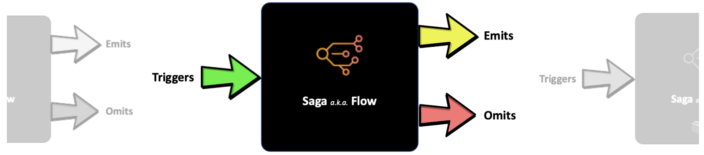

# observability

Deploys an event-driven (a.k.a. distributed) stack on AWS, generates some logs and traces to evaluate observability tooling available in **AWS 🤝 Serverless** space.

## Design

### Triggers

They define what can trigger the saga (a.k.a. flow).

> Uses: _Trigger Queue & Lambda_

### Saga

The saga itself.

> Uses: _StepFunction_

### Emitters

They handle emission of key business events from the saga to outside.

> Uses: _Topic per business event_

### Omitters

They handle all omissions (read as errors & exceptions).

> Uses: _Dead Letter Queue & Lambda_

## Tech Stack

- **AWS StepFunctions** - for running sagas / orchestration flows.
- **AWS SQS** - for reliable, guaranteed communication.
- **AWS SNS** - for fire-and-forget style communication.
- **AWS Lambdas** - for compute logic & replay.

## Deploy

- `yarn`
- `yarn deploy`

## Test

- `yarn test`
